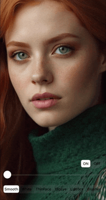
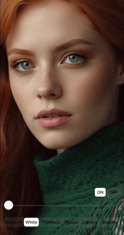
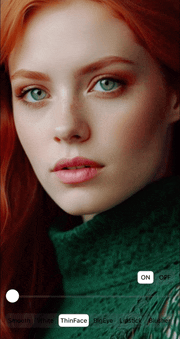
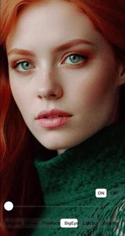
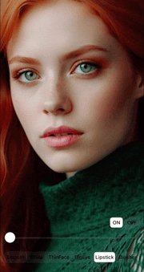
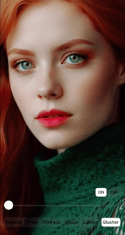
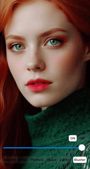
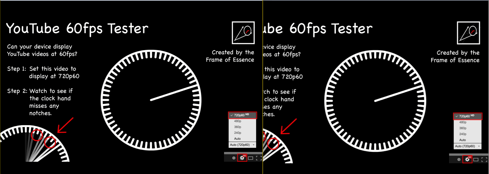

# Windows 实时视频美颜播放器 

## ♿️项目概述 

本项目是一个基于 [GPUPixel](https://github.com/pixpark/gpupixel) 开发的 Windows 系统实时视频美颜播放器(屏幕捕获)。GPUPixel 是一个高性能、易于集成的图像和视频过滤库，本播放器借助其强大的功能，实现了对视频的实时美颜处理，为用户带来更加出色的视觉体验。 

## 🧐功能特性 

### 美颜效果 

- **皮肤平滑**：有效减少皮肤瑕疵，使皮肤看起来更加光滑细腻。 
- **皮肤美白**：提升皮肤亮度，实现美白效果。 
- **瘦脸大眼**：对脸部轮廓进行调整，达到瘦脸和放大眼睛的视觉效果。
- **口红腮红**：为人物添加口红和腮红效果，增添气色。 

### 实时处理 

对视频流进行实时美颜处理，确保播放过程中无明显延迟，流畅度高。 

### 屏幕捕获

程序使用 WGC 接口进行窗口捕获，通过捕获其他窗口的图像作为程序输入。

### 拓展支持

可以基于[GPUPixel](https://github.com/pixpark/gpupixel) 项目的文档进行自定义的滤镜开发。

## 💃效果展示 

### 美颜效果

此处引用[GPUPixel](https://github.com/pixpark/gpupixel) 项目的美颜效果演示。

|              **原图**              |                **磨皮**                |               **美白**               |                 **瘦脸**               |
| :--------------------------------: | :------------------------------------: | :----------------------------------: | :------------------------------------: |
|  |      |      |  |
|              **大眼**              |                **口红**                |               **腮红**               |                 **开关**               |
|  |  |  |      |

### 延迟演示

**录制存在掉帧，仅参考视频延迟即可，左侧为原始画面**

## 😲环境要求

- **操作系统**：Windows 10 及以上版本 
- **开发环境**：Visual Studio 2017 及以上（需支持 C++17） 
- **依赖库**：    
- OpenGL：GPUPixel 基于 OpenGL/ES 构建，需确保系统支持 OpenGL。    
- GPUPixel 库：请按照 [GPUPixel 构建文档](https://gpupixel.pixpark.net/guide/build) 进行编译和安装。

## 📄许可证

本项目基于 [Apache - 2.0 许可证](https://github.com/pixpark/gpupixel?tab=Apache-2.0-1-ov-file) 开源。请确保在使用和分发本项目时遵守该许可证的规定。

## 🙏致谢

感谢 [GPUPixel](https://github.com/pixpark/gpupixel) 项目的开源贡献，为我们提供了强大的图像和视频过滤库。
